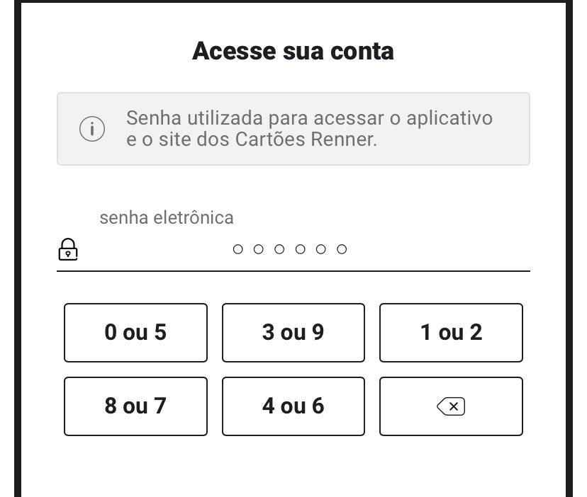

# Teclado Virtual para Sites

Você já deve ter visto o seguinte tipo de teclado:

O usuário tem sempre a escolha de botões para escolher a ordem dos dígitos da senha de acesso. Como temos duas possibilidades em cada botão, fica mais difícil alguém que esteja “olhando por cima do ombro” ver a combinação de dígitos.

Para uma senha de 6 dígitos, demos 26 = 64 possibilidades de “adivinhação” de senha. Como os sites normalmente bloqueiam a conta na terceira tentativa errada de digitação, a segurança é bastante elevada.

O objetivo deste desafio é:

Implementar um frontend básico para apresentação dos dados e clique nos botões;

Implementar um BD MySQL para armazenamento dos dados dos usuários (não é necessário um CRUD de usuários)

Ao abrir a tela com o teclado, a página deve solicitar ao servidor um ID de sessão, que deverá ter codificado em seu interior os pares de teclas e a ordem em que devem ser apresentadas na tela (desta forma, sempre teremos um teclado diferente – tanto em pares como em ordem de apresentação).

Ao submeter os dados ao servidor, o ID de sessão deve ser destruído após a validação dos dados (estando corretos ou não, deve ser apresentado um novo teclado)

Implementar a lógica para validação da senha no backend. Deve ser validado se o ID de sessão não foi marcado como destruído.

O teclado no front end deve variar as posições e números de acordo com a apresentação definida pelo servidor (o formato que o backend deve enviar o layout do teclado a cada nova interação deve ser definido pela equipe)

Deve-se observar a otimização da lógica, para diminuir o máximo possível as interações cliente-servidor e consultas ao Banco de Dados. 
